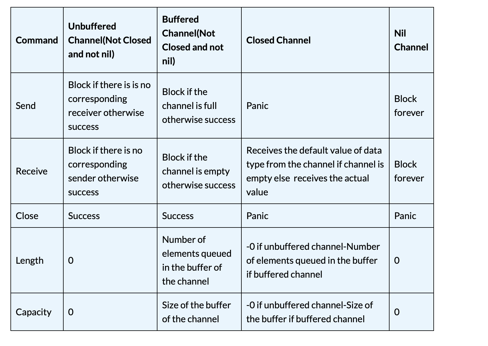
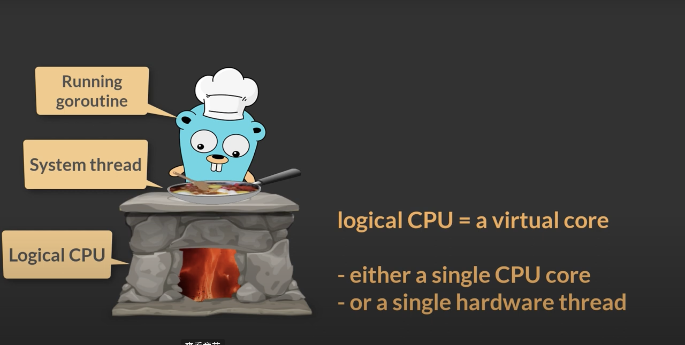
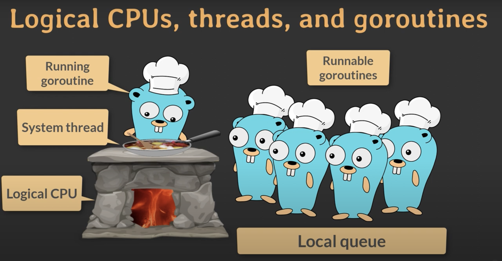
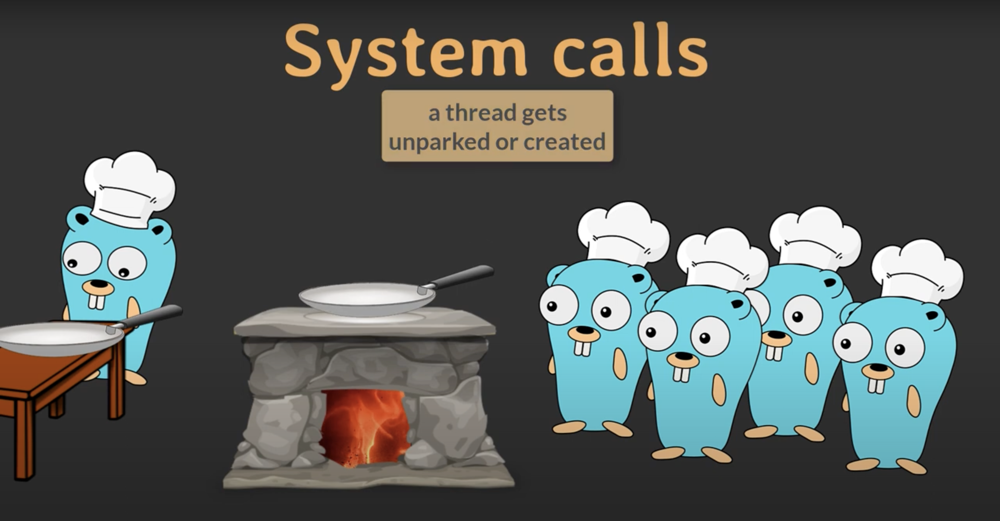
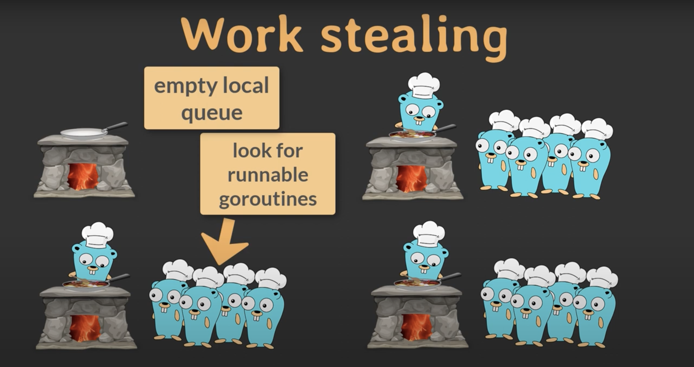
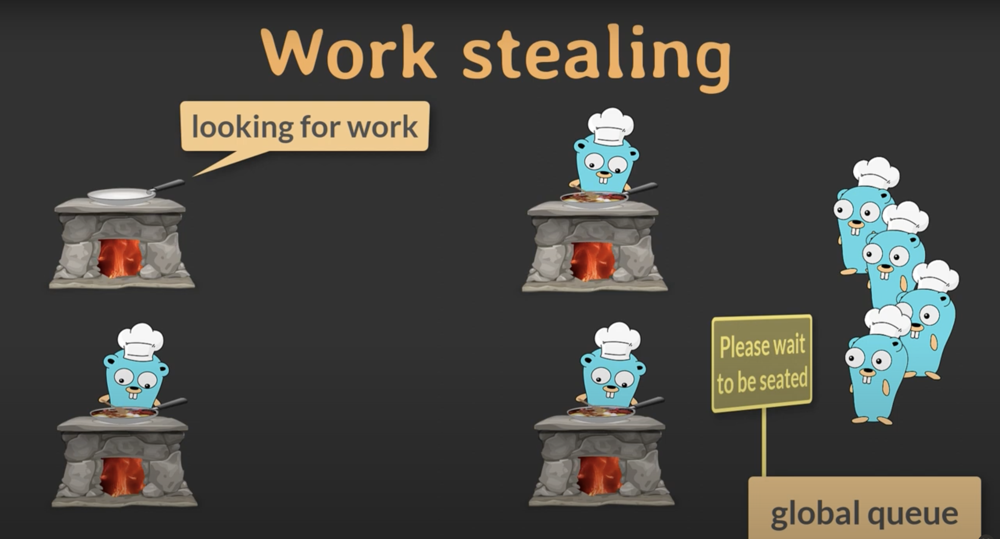

# Go Learning [website](https://golangbyexample.com/)

## Basic Syntax

### comment
use '//' or '/* comment */' to comment

### Data Type
int, float32, bool, array, string, slice, map, pointer, struct, interface, func, interface{}, rune

*note: interface{} represents any type*

### Function
func funcName(name1 type1, name2 type2) returnType {
    ....
}

## Advanced

### struct
``` go
type Person struct {
    name string
    age int
    job string
    salary int
}
```

### Interface
```go
type Shape interface {
    Area() float64
    Perimeter() float64
}

type Rectangle struct {
    width  float64
    height float64
}

func (r Rectangle) Area() float64 {
    return r.width * r.height
}

func (r Rectangle) Perimeter() float64 {
    return 2 * (r.width + r.height)
}
```

### Interface{}
interface{} is a type that can represents any type because it doesn't require structs to implement any method.

```go
func describe(value interface{}) {
    fmt.Printf("Type: %T, Value: %v\n", value, value)
}

describe(42)
describe("Hello")
describe([]int{1, 2, 3})
```

### Defer
**defer func()**: func() will be called when its surrounding function ends or terminates abruptly in last-in-last-out way.

### Go
**go func()**: 'go func()' creates a sub goroutine

### IOTA
used to create constants effectively.
* A counter which starts with zero
* Increases by 1 after **each line**
* Is only used with constant
```go
const (
    a = iota
    b
    c
)
```

### Channel
Channel is a data type in Go which provides synchrounization and communication between goroutines. They can be thought of as pipes which is used by goroutines to communicate. This communication between goroutines doesn’t require any explicit locks. Locks are internally managed by channel themselves. Channel along with goroutine makes the go programming language concurrent. So we can say that golang has two  concurrency primitives:

* Goroutine – lightweight independent execution to achieve concurrency/parallelism.
* Channels – provides synchronization and communication between goroutines.

1. ch <- 1              # send data
2. val := <- ch         # receive data
3. make(chan int)       # create a unbuffered channel
4. make(chan int, 4)    # create a buffered channel with a capacity of 4
5. ch<- int             # channel that can only receive data
6. <-ch int             # channel that can only send data
7. len(ch)              # the number of elements that are already there in the channel
8. cap(ch)              # capacity of the channel
9. close(ch)            # close a channel


### Select Statement
* The select blocks until any of the case statements are ready. 
* If multiple case statements are ready then it selects one at random and proceeds. 

1. **default**: be executed if no send or receive operations are ready.
2. can use for-loop to execute all cases

### Error
Advantages of using error as a type
```go
type error interface {
    Error() string
}
```

* It allows more control over handling the error. The error can be checked at each step
* Prevents the ugly code of try-catch and exception handling

1. **Wrap the Error**: e := fmt.Errorf("... %w ...", ..., err, ...)
2. **Unwrap an error**: 
3. **Check if two error are equal**: use '==' or 'errors.Is(err1, err2)'. 'Is()' can check the equality by unwrapping the error.

### Panic and Recover

Panic in golang is similar to the exception. Panic is meant to exit from a program in abnormal conditions. Panic can occur in a program in two ways

* Runtime error in the program
* By calling the panic function explicitly: **panic(v interface{})**

## GOROUTINE
1. A goroutine runs on a logical CPU. **A logical CPU** = **a single CPU core** or **a single hardware threading.**

2. For each logical CPU, there is one local queue that contains many **Runnable** goroutines. 
3. The goroutines use **cooperative scheduling**, which means sometimes the running goroutine gives way to one of the waiting goroutines. For example, when it has to wait on a channel to deliver data. It's **efficient** because it happens local.
4. **System Calls**: Sometimes, goroutines need to do system calls such as writing data to a file. This time, the thread typically is parked, and another thread will be created and takes over the local queue.
5. **Work Stealing**: 
* **Steal local queue:** When there is a empty local queue on a running thread, the scheduler will take half of the other queue over. 
* **Global Queue:** If there is no local queue to steal, the scheduler will look at the global queue and assign them to threads.

## Garbage Collection
1. No Garbage Collection: like C/C++
```c++
free(ptr);
delete ptr;
```
2. **Counting Method**: For each part of memory we allocate, set a counter recording how many places are using it. when the counter turns down to zero. The garbage collector will retrive the memory. <br>
**Difficult to operate**, **time-consuming**, and **space-consuming, and has circular reference problem.**
3. **Mark and Sweep(Go):** using tri-color marking algorithm to track object and their references.

**Tri-color algo**: Initially, the **root set** contains the references of all objects that can be  accessed. And there are three sets: **White, Grey, Black**, and all references in the root set are in the White.
* White set: objects need to be swept.
* Grey set: Reachable objects but yet to be scanned for references to "white" objects.
* Black set: Reachable objects that have no references to "white" objects.

Then the alogorithm proceeds as following: 


1. Pick an object from the grey set and move it to the black set.
2. Move each white object it references to the grey set. This ensures that neither this object nor any object it references can be garbage-collected.
3. Repeat the last two steps until the grey set is empty.


**Pros:** This algo can proceed with the program concurrently by maintaining those three sets.

## Others
1. 'var a int', or 'a := 2' to initialize variable
2. if-else: 'else' must be placed next to the curly brackets.
3. "[]int" represents **slice**, whose length is variable. "[...]int" or "[3]int" reprents **array**.
4. Golang only has **for** used for Loop Statement: "for i := 0; i < n; i++", "for condition", or for i := **range** arr
5. **"make"** can only be used to create "slice", "map", and "channel".
6. The parameters are **passed by value** in Golang. Worth mentioning that *channel*, *map*, and *slice* are regareded as pointer, like in C/C++.


